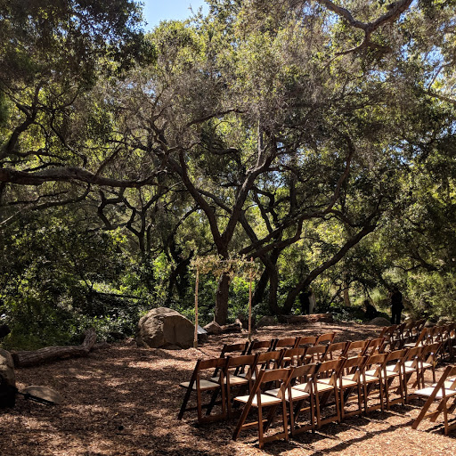

# 3D-Cube-Animation-with-Image
body{
  background: #303030;
}
.contenedor {
  -webkit-perspective: 500px;
  perspective: 500px;
  perspective-origin: 50% 50%;
}

.cube, .cube .card{
  height: 290px;
  width: 290px;
}

.cube {
  -webkit-transform-style: preserve-3d;
  transform-style: preserve-3d;

  -webkit-transform: rotateX(-30deg) rotateY(30deg);
  transform: rotateX(-30deg) rotateY(-30deg);

  margin: 150px auto;

  -webkit-animation: giro 20s infinite linear;
  animation: giro 20s infinite linear;
}

.cube .card {
  position: absolute;
  border: 5px solid #ccc;
  opacity: 0.85;
  transition: 0.2s;
}
/* Pause animation on hover */
.cube:hover{
    animation-play-state: paused;
}
.cube:hover .card{
   opacity: 1;
   transition: 0.2s;
}

/*card frontal*/
.cube .card:nth-child(1) {
  -webkit-transform: translateZ(150px);
  transform: translateZ(150px);
}
/*card posterior*/
.cube .card:nth-child(2) {
  -webkit-transform: rotateY(180deg) translateZ(150px);
  transform: rotateY(180deg) translateZ(150px);
}
/*card izquierda*/
.cube .card:nth-child(3) {
  -webkit-transform: rotateY(-90deg) translateZ(150px);
  transform: rotateY(-90deg) translateZ(150px);
}
/*card derecha*/
.cube .card:nth-child(4) {
  -webkit-transform: rotateY(90deg) translateZ(150px);
  transform: rotateY(90deg) translateZ(150px);
}
/*card superior*/
.cube .card:nth-child(5) {
  -webkit-transform: rotateX(90deg) translateZ(150px);
  transform: rotateX(90deg) translateZ(150px);
}
/*card inferior*/
.cube .card:nth-child(6) {
  -webkit-transform: rotateX(-90deg) translateZ(150px);
  transform: rotateX(-90deg) translateZ(150px);
}

@-webkit-keyframes giro {
    0% { -webkit-transform: rotateX(-45deg) rotateY(0deg); }
    50% { -webkit-transform: rotateX(45deg) rotateY(360deg); }
    100% { -webkit-transform: rotateX(-45deg) rotateY(720deg); }
}

@keyframes giro {
    0% { transform: rotateX(-45deg) rotateY(0deg); }
    50% { transform: rotateX(45deg) rotateY(360deg); }
    100% { transform: rotateX(-45deg) rotateY(720deg); }
}

@-webkit-keyframes giro360 {
    0% { -webkit-transform: rotateX(  0deg) rotateY(  0deg); }
  100% { -webkit-transform: rotateX(360deg) rotateY(360deg); }
}

@keyframes giro360 {
    0% { transform: rotateX(  0deg) rotateY(  0deg); }
  100% { transform: rotateX(360deg) rotateY(360deg); }
}
<!DOCTYPE html>
<html lang="en">
<head>
    <meta charset="UTF-8" />
    <meta http-equiv="X-UA-Compatible" content="IE=edge,chrome=1"> 
    <meta name="viewport" content="width=device-width, initial-scale=1.0"> 
    <title>CSS3 3D Cube Animation with Image Example</title>
    <meta name="author" content="Codeconvey" />
    
    <!-- Style CSS -->
    <link rel="stylesheet" href="css/style.css">
    
    <!--Only for demo purpose - no need to add.-->
    <link rel="stylesheet" type="text/css" href="css/demo.css" />
	
</head>
<body>
		

    

        

            <!-- AD HERE -->
            
        

        

            <ul>
                <li><a href="https://codeconvey.com/css3-3d-cube-animation-with-image">Back to Tutorial</a></li>
            </ul>
        

    

<header class="ScriptHeader">
    

    	

        	

            	<h1>CSS3 3D Cube Animation with Image Example</h1>
                
Cube animated clickable images with CSS3.

            

        

    

</header>

<section>
    

          

              

              
<!-- partial:index.partial.html -->

 
			

				

                    
                        

				

                    
                        

				

                    
                        

				

                    
                        

				

                    
                        

				

                    
				

                    
			

		

<!-- partial -->
    		
           
    		

		

    

</section>
     

   <!-- ANALYTICS -->

	</body>
</html>
